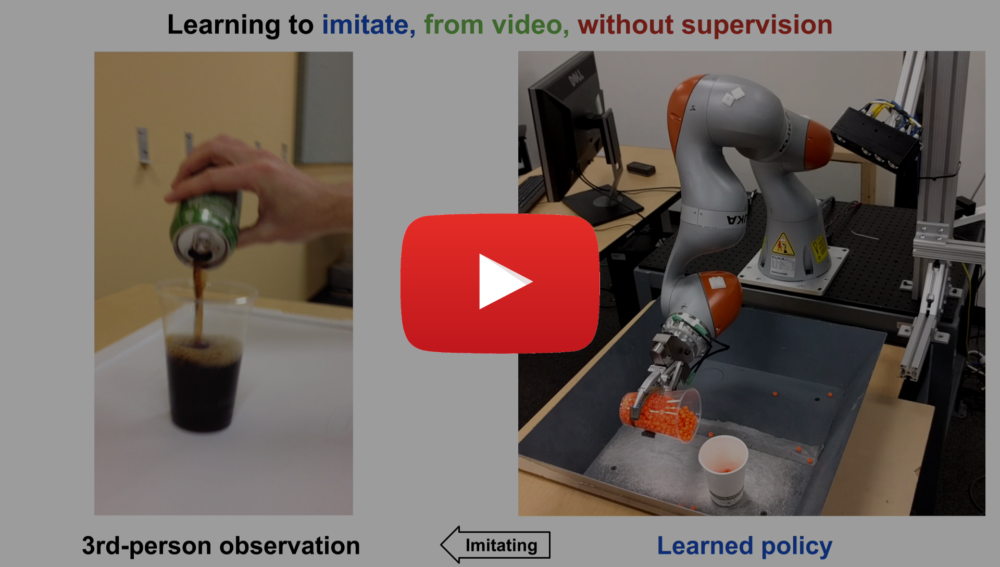
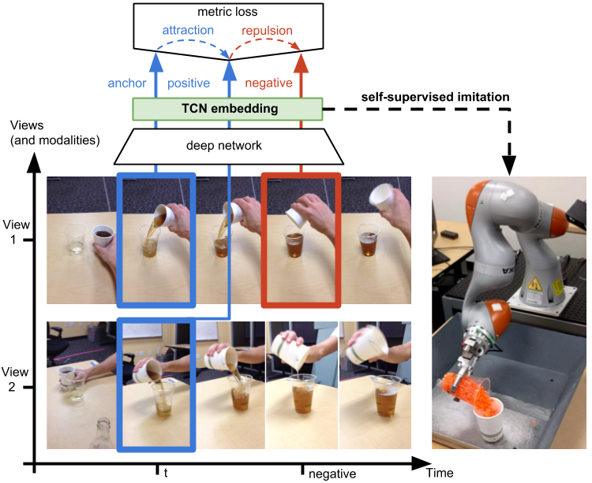

[Pierre Sermanet](https://sermanet.github.io/home/)<sup>1</sup>\*, Corey Lynch<sup>1</sup>\*†, Yevgen Chebotar<sup>2</sup>\*, Jasmine Hsu<sup>1</sup>, Eric Jang<sup>1</sup>, Stefan Schaal<sup>2</sup>, [Sergey Levine](https://people.eecs.berkeley.edu/~svlevine/)<sup>1</sup><br>
<sup>1</sup> Google Brain, <sup>2</sup> University of Southern California<br>
(* equal contribution, † Google Brain Residency program [g.co/brainresidency](https://research.google.com/teams/brain/residency/))

This project is part of the larger [Self-Supervised Imitation Learning](https://sermanet.github.io/imitation/) project.
It extends the [TCN project](https://sermanet.github.io/tcn/) with Reinforcement Learning and more real robots.

### [[ Paper ]](https://arxiv.org/abs/1704.06888) [[ BibTex ]](https://github.com/sermanet/home/blob/master/docs/bib/Sermanet2017TCN.bib) [[ Video ]](https://www.youtube.com/watch?v=b1UTUQpxPSY) [[ Dataset ]](https://sites.google.com/site/brainrobotdata/home/multiview-pouring) [[ Code ]](https://github.com/tensorflow/models/tree/master/research/tcn) [[ Slides ]](https://docs.google.com/presentation/d/1EvWSbsFfnceBpN7yG1wnqM2LxySQ0Gi-wTx6QaoVekY/edit?usp=sharing)

<a href="http://www.youtube.com/watch?feature=player_embedded&v=b1UTUQpxPSY" target="_blank">
 
</a>

##### Abstract

We propose a self-supervised approach for learning representations and robotic behaviors entirely from unlabeled videos recorded from multiple viewpoints, and study how this representation can be used in two robotic imitation settings: imitating object interactions from videos of humans, and imitating human poses. Imitation of human behavior requires a viewpoint-invariant representation that captures the relationships between end-effectors (hands or robot grippers) and the environment, object attributes, and body pose.
We train our representations using a triplet loss, where multiple simultaneous viewpoints of the same observation are attracted in the embedding space, while being repelled from temporal neighbors which are often visually similar but functionally different. This signal causes our model to discover attributes that do not change across viewpoint, but do change across time, while ignoring nuisance variables such as occlusions, motion blur, lighting and background.
We demonstrate that this representation can be used by a robot to directly mimic human poses without an explicit correspondence, and that it can be used as a reward function within a reinforcement learning algorithm. While representations are learned from an unlabeled collection of task-related videos, robot behaviors such as pouring are learned by watching a single 3rd-person demonstration by a human. Reward functions obtained by following the human demonstrations under the learned representation enable efficient reinforcement learning that is practical for real-world robotic systems.

### Self-supervised imitation


### Approach





# Citation

```
@article{TCN2017,
  title={Time-Contrastive Networks: Self-Supervised Learning from Video},
  author={Sermanet, Pierre and Lynch, Corey and Chebotar, Yevgen and Hsu, Jasmine and Jang, Eric and Schaal, Stefan and Levine, Sergey},
  journal={arXiv preprint arXiv:1704.06888},
  year={2017}
}
```

# Acknowledgments

We thank Mohi Khansari, Yunfei Bai and Erwin Coumans for help with VR simulations, Jonathan Tompson, James Davidson and Vincent Vanhoucke for helpful discussions and feedback. We thank everyone who provided imitations for this project: Phing Lee, Alexander Toshev, Anna Goldie, Deanna Chen, Deirdre Quillen, Dieterich Lawson, Eric Langlois, Ethan Holly, Irwan Bello, Jasmine Collins, Jeff Dean, Julian Ibarz, Ken Oslund, Laura Downs, Leslie Phillips, Luke Metz, Mike Schuster, Ryan Dahl, Sam Schoenholz and Yifei Feng.
